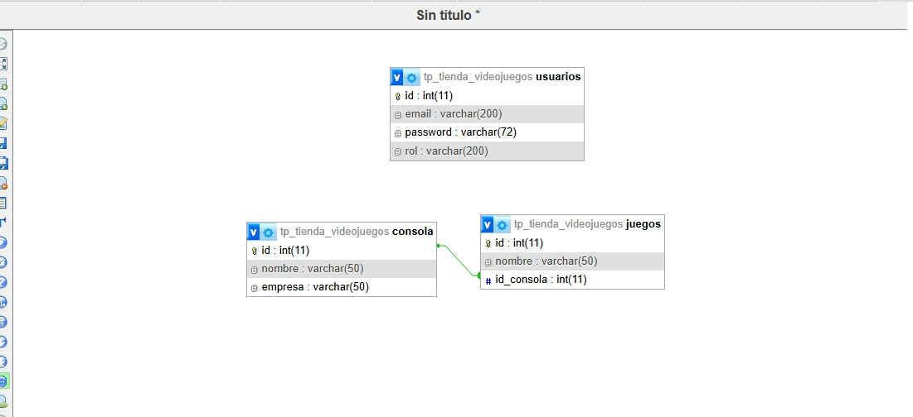

#TPE - Tienda de Videojuegos
---------------------------------------

#Integrantes del grupo
---------------------------------------

NOMBRE Y APELLIDO: HERNÁN LUIS VALEA.
EMAIL: valea.190455@gmail.com

NOMBRE Y APELLIDO: GONZALO RUSSO. 
EMAIL: GONZALORUSSO39@GMAIL.COM

---------------------------------------
#Temática del TPE:
---------------------------------------

Catalogo de Videojuegos.

Descripción:

El sitio contendrá un catalogo videojuegos, donde cada juego va tener una categoría consola.

--------------------------------------------------------
#Diagrama de Entidad-Relación (DER): 
-------------------------------------------------------
El DER está en el archivo: 
DiagramaOk.jpeg
## 🎮 Diagrama de base de datos

 


Descripción general del DER:
----------------------------
El modelo contiene:

Videojuego: Cada juego disponible en el catálogo. ID Auto incrementable, Nombre, ID_consola.
Consola: ID auto incrementable, nombre consola, nompre empresa.


---------------------------------------------------------------

#Tabla Usuarios:
-------------------------------------------------------------
Usuario: ID auto incrementable, rol, email, password.

---------------------------------------------------------

#Código SQL de la BBDD
-----------------------------------------------------------

El código de la DB se encuentra en


## 🗄️ Base de datos:
`tp_tienda_videojuegos.sql`

```sql

 
--
-- Base de datos: `tp_tienda_videojuegos`
--

-- --------------------------------------------------------

--
-- Estructura de tabla para la tabla `consola`
--

CREATE TABLE `consola` (
  `id` int(11) NOT NULL,
  `nombre` varchar(50) NOT NULL,
  `empresa` varchar(50) NOT NULL
) ENGINE=InnoDB DEFAULT CHARSET=utf8mb4 COLLATE=utf8mb4_general_ci;

--
-- Volcado de datos para la tabla `consola`
--

INSERT INTO `consola` (`id`, `nombre`, `empresa`) VALUES
(1, 'ps3', 'sony'),
(2, 'xbox', 'microsoft');

-- --------------------------------------------------------

--
-- Estructura de tabla para la tabla `juegos`
--

CREATE TABLE `juegos` (
  `id` int(11) NOT NULL,
  `nombre` varchar(50) NOT NULL,
  `id_consola` int(11) NOT NULL
) ENGINE=InnoDB DEFAULT CHARSET=utf8mb4 COLLATE=utf8mb4_general_ci;

--
-- Volcado de datos para la tabla `juegos`
--

INSERT INTO `juegos` (`id`, `nombre`, `id_consola`) VALUES
(11, 'THE WITCHER 3', 1);

-- --------------------------------------------------------

--
-- Estructura de tabla para la tabla `usuarios`
--

CREATE TABLE `usuarios` (
  `id` int(11) NOT NULL,
  `email` varchar(200) NOT NULL,
  `password` varchar(72) NOT NULL,
  `rol` varchar(200) NOT NULL
) ENGINE=InnoDB DEFAULT CHARSET=utf8mb4 COLLATE=utf8mb4_general_ci;

--
-- Índices para tablas volcadas
--

--
-- Indices de la tabla `consola`
--
ALTER TABLE `consola`
  ADD PRIMARY KEY (`id`);

--
-- Indices de la tabla `juegos`
--
ALTER TABLE `juegos`
  ADD PRIMARY KEY (`id`),
  ADD KEY `id_categoria` (`id_consola`);

--
-- Indices de la tabla `usuarios`
--
ALTER TABLE `usuarios`
  ADD PRIMARY KEY (`id`);

--
-- AUTO_INCREMENT de las tablas volcadas
--

--
-- AUTO_INCREMENT de la tabla `consola`
--
ALTER TABLE `consola`
  MODIFY `id` int(11) NOT NULL AUTO_INCREMENT, AUTO_INCREMENT=3;

--
-- AUTO_INCREMENT de la tabla `juegos`
--
ALTER TABLE `juegos`
  MODIFY `id` int(11) NOT NULL AUTO_INCREMENT, AUTO_INCREMENT=12;

--
-- AUTO_INCREMENT de la tabla `usuarios`
--
ALTER TABLE `usuarios`
  MODIFY `id` int(11) NOT NULL AUTO_INCREMENT;

--
-- Restricciones para tablas volcadas
--
