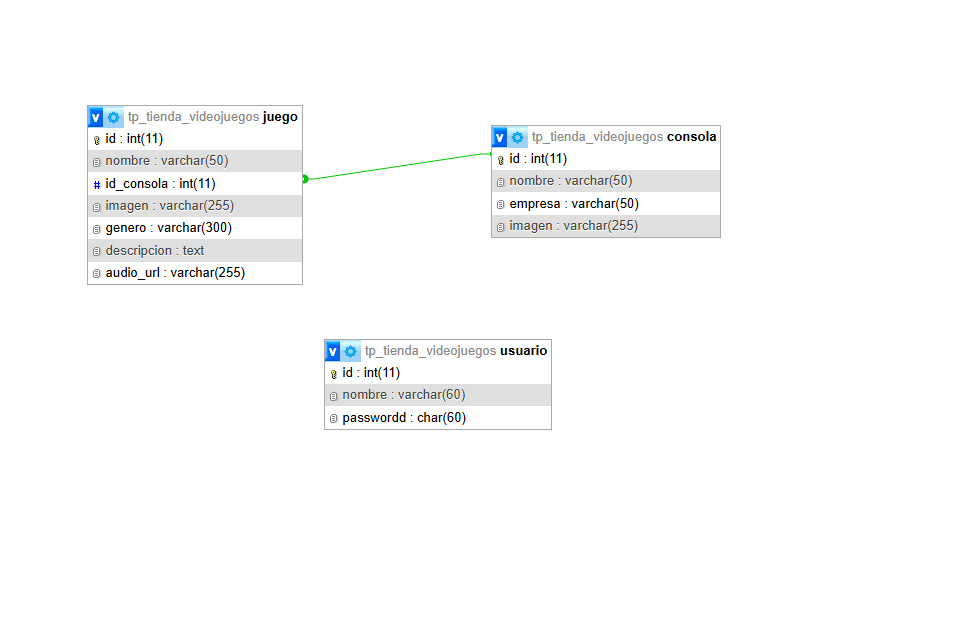

#TPE - Tienda de Videojuegos
---------------------------------------

#Integrantes del grupo
---------------------------------------

NOMBRE Y APELLIDO: HERNÁN LUIS VALEA.
EMAIL: valea.190455@gmail.com

NOMBRE Y APELLIDO: GONZALO RUSSO. 
EMAIL: GONZALORUSSO39@GMAIL.COM

#XAMPP INSTALACIÓN DEL PROYECTO 
---------------------------------------
Primero, instalá XAMPP y abrí su Panel de Control. Arrancá Apache para que tu servidor web funcione y MySQL si tu proyecto necesita base de datos. Todo lo que quieras que se muestre en el navegador debe estar dentro de la carpeta htdocs de XAMPP, que es la raíz de tu servidor local. Si todavía no tenés tu proyecto, podés clonarlo desde GitHub usando git clone dentro de htdocs. Una vez que tengas la carpeta de tu proyecto, podés actualizarla en cualquier momento con git pull para traer los últimos cambios del repositorio remoto. Después abrí el navegador y escribí http://localhost/nombre-del-proyecto para ver tu aplicación funcionando. El menú de navegación (nav) y todos los archivos se cargarán automáticamente según cómo los tengas en tu proyecto.

---------------------------------------
#Temática del TPE:
---------------------------------------

Catalogo de Videojuegos.

Descripción:

El sitio contendrá un catalogo videojuegos, donde cada juego va tener una categoría consola.

--------------------------------------------------------
#Diagrama de Entidad-Relación (DER): 
-------------------------------------------------------
El DER está en el archivo: 
DIAGRAMADER-.jpeg
## 🎮 Diagrama de base de datos

 


Descripción general del DER:
----------------------------
El modelo contiene:

Videojuego: Cada juego disponible en el catálogo. ID Auto incrementable, Nombre, ID_consola, descripcion, imagen, audio.

Consola: ID auto incrementable, nombre consola, nombre empresa, imagen.


---------------------------------------------------------------

#Tabla Usuarios:
-------------------------------------------------------------
Usuario: ID auto incrementable, nombre, password.

---------------------------------------------------------

#Código SQL de la BBDD
-----------------------------------------------------------

El código de la DB se encuentra en


## 🗄️ Base de datos:
tp_tienda_videojuegos.sql

```sql
-- phpMyAdmin SQL Dump
-- version 5.2.1
-- https://www.phpmyadmin.net/
--
-- Servidor: 127.0.0.1
-- Tiempo de generación: 10-11-2025 a las 07:32:40
-- Versión del servidor: 10.4.32-MariaDB
-- Versión de PHP: 8.0.30

SET SQL_MODE = "NO_AUTO_VALUE_ON_ZERO";
START TRANSACTION;
SET time_zone = "+00:00";


/*!40101 SET @OLD_CHARACTER_SET_CLIENT=@@CHARACTER_SET_CLIENT */;
/*!40101 SET @OLD_CHARACTER_SET_RESULTS=@@CHARACTER_SET_RESULTS */;
/*!40101 SET @OLD_COLLATION_CONNECTION=@@COLLATION_CONNECTION */;
/*!40101 SET NAMES utf8mb4 */;

--
-- Base de datos: `tp_tienda_videojuegos`
--

-- --------------------------------------------------------

--
-- Estructura de tabla para la tabla `consola`
--

CREATE TABLE `consola` (
  `id` int(11) NOT NULL,
  `nombre` varchar(50) NOT NULL,
  `empresa` varchar(50) NOT NULL,
  `imagen` varchar(255) DEFAULT NULL
) ENGINE=InnoDB DEFAULT CHARSET=utf8mb4 COLLATE=utf8mb4_general_ci;

--
-- Volcado de datos para la tabla `consola`
--

INSERT INTO `consola` (`id`, `nombre`, `empresa`, `imagen`) VALUES
(25, 'XBOX ONE X', 'MICROSOFT', './img/juego/690ed84998796.png'),
(32, 'PS2', 'PLAYSTATION', './img/juego/690ed88c188ad.png'),
(33, 'PS3', 'PLAYSTATION', './img/juego/690ed8b5ec276.png'),
(34, 'MEGA DRIVE', 'SEGA', './img/juego/690ed91768bb3.jpg'),
(36, 'PS4', 'SONY', './img/juego/690ff6148e62a.jpg'),
(37, 'PS5', 'PLAYSTATION', './img/juego/690ffc2990924.jpg'),
(44, 'XXVB', 'ROCKSTAR GAMES', NULL);

-- --------------------------------------------------------

--
-- Estructura de tabla para la tabla `juego`
--

CREATE TABLE `juego` (
  `id` int(11) NOT NULL,
  `nombre` varchar(50) NOT NULL,
  `id_consola` int(11) NOT NULL,
  `imagen` varchar(255) DEFAULT NULL,
  `genero` varchar(300) NOT NULL,
  `descripcion` text NOT NULL,
  `audio_url` varchar(255) DEFAULT NULL
) ENGINE=InnoDB DEFAULT CHARSET=utf8mb4 COLLATE=utf8mb4_general_ci;

--
-- Volcado de datos para la tabla `juego`
--

INSERT INTO `juego` (`id`, `nombre`, `id_consola`, `imagen`, `genero`, `descripcion`, `audio_url`) VALUES
(184, 'WATCH DOGS ', 33, './img/juego/69115520ea7c9.jpg', 'ACCION', 'Watch Dogs sigue a Aiden Pearce, un hacker experto cuya vida cambia drásticamente cuando un ataque violento termina con la muerte de su sobrina. Movido por la venganza, Aiden se adentra en la ciudad de Chicago, una metrópolis controlada por ctOS, un sistema central que gestiona la infraestructura, el tráfico, la seguridad y las comunicaciones de la ciudad.\r\n\r\nUsando sus habilidades de hackeo, Aiden puede manipular cámaras, semáforos, dispositivos electrónicos y sistemas bancarios para espiar, sabotear y derrotar a sus enemigos. La historia combina acción, sigilo y dilemas morales, mostrando cómo la tecnología puede ser tanto una herramienta de poder como un arma peligrosa.', 'uploads/audios/audio_69115520e9b2a8.03153405.mp3'),
(185, 'DARK SIDERS 2', 36, './img/juego/691155a7ade07.jpg', 'RPG', 'En Darksiders II, controlás a Muerte (Death), uno de los Cuatro Jinetes del Apocalipsis, quien busca limpiar el nombre de su hermano Guerra, acusado injustamente de desencadenar el Apocalipsis en el primer juego.\r\n\r\nLa historia te lleva a través de un mundo oscuro y devastado, lleno de enemigos sobrenaturales, mazmorras, y ciudades antiguas. Mientras Muerte busca reunir pistas y enfrentarse a poderosos adversarios, explora secretos que revelan la corrupción y el conflicto entre el Cielo, el Infierno y la Tierra. El juego combina acción intensa, exploración y resolución de acertijos, ofreciendo una narrativa épica sobre justicia, sacrificio y destino.', 'uploads/audios/audio_691155a7ad0478.21531037.mp3'),
(187, 'DARK SOULS 3', 37, './img/juego/691157e4bd164.jpg', 'RPG', 'En Dark Souls III, el jugador encarna al “Ashen One”, un guerrero resucitado destinado a unir las llamas y enfrentar el inevitable fin del mundo. Ambientado en el reino decadente de Lothric, la historia gira en torno al ciclo eterno de luz y oscuridad, donde reyes y héroes caídos deben ser enfrentados para restaurar o destruir el equilibrio.\r\n\r\nA lo largo del juego, el jugador explora un mundo oscuro y peligroso, lleno de enemigos mortales, jefes colosales y secretos escondidos. La narrativa se transmite principalmente a través del ambiente, los diálogos crípticos y los objetos del juego, ofreciendo una experiencia inmersiva y desafiante sobre sacrificio, destino y la lucha contra la decadencia.', 'uploads/audios/audio_691157e4b7aad4.24614538.mp3'),
(196, 'VHVH', 34, NULL, 'VHV', 'nmmn', NULL);

-- --------------------------------------------------------

--
-- Estructura de tabla para la tabla `usuario`
--

CREATE TABLE `usuario` (
  `id` int(11) NOT NULL,
  `nombre` varchar(60) NOT NULL,
  `passwordd` char(60) NOT NULL
) ENGINE=InnoDB DEFAULT CHARSET=utf8mb4 COLLATE=utf8mb4_general_ci;

--
-- Volcado de datos para la tabla `usuario`
--

INSERT INTO `usuario` (`id`, `nombre`, `passwordd`) VALUES
(5, 'webadmin', '$2y$10$6Ge281/ahvQXqKlraqhHPuA7xIQ.YwO4o7uN465K/w58B7jv/BtCG');

--
-- Índices para tablas volcadas
--

--
-- Indices de la tabla `consola`
--
ALTER TABLE `consola`
  ADD PRIMARY KEY (`id`);

--
-- Indices de la tabla `juego`
--
ALTER TABLE `juego`
  ADD PRIMARY KEY (`id`),
  ADD KEY `id_categoria` (`id_consola`);

--
-- Indices de la tabla `usuario`
--
ALTER TABLE `usuario`
  ADD PRIMARY KEY (`id`);

--
-- AUTO_INCREMENT de las tablas volcadas
--

--
-- AUTO_INCREMENT de la tabla `consola`
--
ALTER TABLE `consola`
  MODIFY `id` int(11) NOT NULL AUTO_INCREMENT, AUTO_INCREMENT=45;

--
-- AUTO_INCREMENT de la tabla `juego`
--
ALTER TABLE `juego`
  MODIFY `id` int(11) NOT NULL AUTO_INCREMENT, AUTO_INCREMENT=197;

--
-- AUTO_INCREMENT de la tabla `usuario`
--
ALTER TABLE `usuario`
  MODIFY `id` int(11) NOT NULL AUTO_INCREMENT, AUTO_INCREMENT=6;

--
-- Restricciones para tablas volcadas
--

--
-- Filtros para la tabla `juego`
--
ALTER TABLE `juego`
  ADD CONSTRAINT `juego_ibfk_1` FOREIGN KEY (`id_consola`) REFERENCES `consola` (`id`) ON DELETE CASCADE ON UPDATE CASCADE;
COMMIT;

/*!40101 SET CHARACTER_SET_CLIENT=@OLD_CHARACTER_SET_CLIENT */;
/*!40101 SET CHARACTER_SET_RESULTS=@OLD_CHARACTER_SET_RESULTS */;
/*!40101 SET COLLATION_CONNECTION=@OLD_COLLATION_CONNECTION */;
